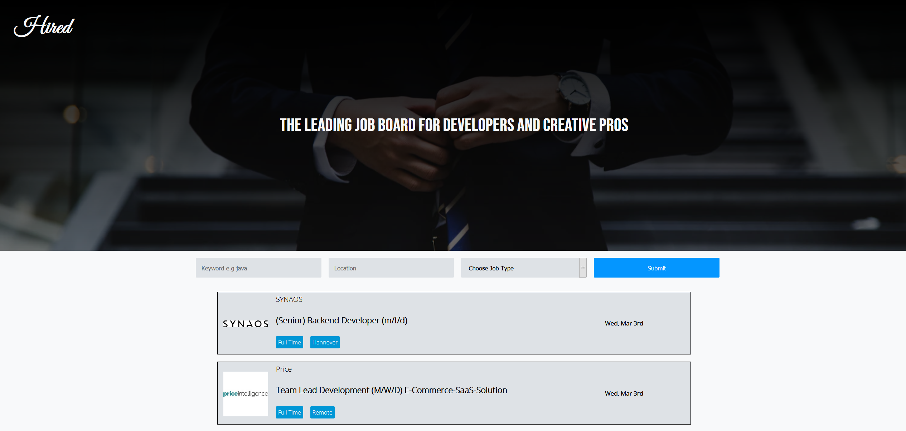

# Hired

DevHire is a job board application built in React.

## Tech Stack

For this project I used:

- React
- Styled-Components
- Github API
- Formik
- React-router

## Live Site

You can see the live version of the application [here](https://devhire.vercel.app)

## Project 
In the project directory, you can run:

### `npm start`

Runs the app in the development mode.\
Open [http://localhost:3000](http://localhost:3000) to view it in the browser.

The page will reload if you make edits.\
You will also see any lint errors in the console.

### `npm run build`

Builds the app for production to the `build` folder.\
It correctly bundles React in production mode and optimizes the build for the best performance.

See the section about [deployment](https://facebook.github.io/create-react-app/docs/deployment) for more information.
